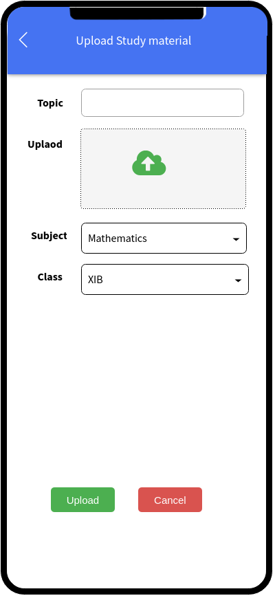

## Overview
<b>"My Classroom"</b> is a software solution to simplify the complexities of managing the daily activities in an educational institute like schools, colleges. This app is one stop solution for teachers, school admins to work together with students to provide seamless learning experience. "My Classroom" provides various features to manage daily activities like attendance, assignments, communication/leaning assistance etc. all accessible using common dashboard in the app. Considering internet availability challenges across India the app can be used in offline and online mode.

## Today’s challenges 
- COVID-19 has created a paradigm shift in India’s Education System which has forced universities/schools to bring their courses online.
- Most of the primary, secondary and tertiary learners in the India — are no longer able to physically go to school.
- The impact has been dramatic and transformative as educators scramble to put in place workable solutions for remote teaching and learning. This has been challenging considering that students and schools now face additional difficulties related to financing and availability of digital resources.
- We feel this is the first step along the road to a new education system. We can expect a new model to emerge once COVID-19 has passed.

## Case Study
<ul>
 <li> We conducted the survey with various schools to understand the day to day challenges that they are facing while adapting the new norm of E-learning and conducting the online classes. </li>
<li>This has helped us to identify some of the most common issues faced by School Admins (Principal/Vice Principal), Class Teacher, Subject Teacher and Students as follows. </li>
<li><ul>
 <li>Managing attendance and student availability</li>
 <li>Managing assignments, tasks and school work for students</li>
 <li>Commination hurdles </li>
 <li>Use of multiple platforms / apps to convey the right information</li>
 <li>Issues in accessing these platforms due to limited internet availability</li>
 </ul>
 </li>
 </ul>

##  Key Features 

-	Attendance and Progress tracking
-	Publish and track Quiz / Assignments 
-	Schedule and Conduct classes
-	Video/Audio Conferencing
-	Study material management
- Offline mode 
- Push Notifications

## Security features

- Two Factor Authentication
- HTTPS REST end points
- Data Encryption at REST
- Data Integration and Validation Checks

## Supported Platform

- Android
- IOS
- Web

## UI Design
<ul>
 <li>Simplified user interface for all category of users</li>
 <li>Easy access of information with minimum clicks</li>
 <li>Consistent user experience across Android & IOS mobile platforms</li>
</ul>

<h3 id="principal-design-flow"> Principal Design Flow </h3>
 The key for the School Authority or Principal is to have an overall view of all the activities taking place in the school. The primary functionalities available for them in the app are –
<h4> Key Features for Principal </h4>
<ul>
 <li>Dashboard</li>
 <li>Create/Manage Announcements for the School</li>
 <li>Keep a track of any requests raised</li>
 <li>Video/Audio Conferencing</li>
 <li>One to One/Group chat with teachers and faculties</li>
 <li>Tracking attendance of teachers, faculties (non-teaching staff) and students</li>
 </ul>

 <h4>Principal User Interface</h4>

 <table>
 <th>Principal Login</th>
  <th>Principal Dashboard</th>
 <tr>
   <td>
       
   </td>
  <td>
        
   </td>
</tr>
</table>

 <table>
 <th>View Announcement</th>
 <th>Create new Announcement</th>
  <th>Approve Pending Request</th>

 <tr>
   <td>
       
   
   </td>
  <td>
        
   
   </td>
     <td>
    
   </td>
</tr>
</table>

 <table>
 <th>Video Conferencing</th>
 <th>Principal Chat Room</th>
 <tr>
   <td>
  
  </td>
 <td>
  
  </td>
</tr>
</table>

<h3 id="teacher-design-flow">Teacher Design Flow</h3>
The key for the Teacher is to have an ability to conduct online classes, track the progress of each student etc. The primary functionalities available for them in the app are 

<h4>Key Features for Teacher</h4>

<ul>
<li>Create and conduct classes</li>
<li>Video Conferencing</li>
<li>Manage assignments</li>
<li>Track attendance of students attending the class</li>
<li>Manage study material</li>
<li>Manage announcements for a class</li>
</ul>

 <h4>Teacher User Interface</h4>

<table>
 <th>Login</th>
 <th>Dashboard</th>
 <tr>
   <td>
    
  </td>
 <td>
    
  </td>
</tr>
</table>
<table>
  <th>Schedule Classroom</th>
 <th>View Classroom</th>
  <th>Ongoing Classroom Summary</th>

 <tr>
 <td>
  
  </td>
   <td>
  
  </td>
  <td>
  
  </td>
 
 
</tr>
</table>

<table>
 <th>View Study Material</th>
 <th>Create new Study Material</th>
 <tr>
   <td>
  
  </td>
 <td>
  
  </td>
 
</tr>
</table>

<table>
 <th>Manage Assignment</th>
 <th>View Announcement</th>
 <th>Time Table</th>
 <tr>
   <td>
     
  </td>
 <td>
    
  </td>
 <td>
  
  </td>
</tr>
</table>

 <table>
 <th>Video Conferencing</th>
 <th>Teacher Chat Room</th>
 <tr>
   <td>
  
  </td>
 <td>
    
  </td>
</tr>
</table>

<h3 id="student-design-flow">Student Design Flow</h3>
The key for the Students is to have an ability to join classes. The primary functionalities available for them in the app are-

<h4>Key Features for Student</h4>

<ul>
<li>Join Classroom as per schedule</li>
<li>Submit Assignments</li>
<li>Access Study Material</li>
<li>Check Class Timetable</li>
<li>Apply leaves</li>
<li>View Announcement</li>
</ul>

<h4>Student User Interface</h4>

<table>
 <th>Login</th>
 <th>Dashboard</th>
 <tr>
   <td>
  
  </td>
 <td>
  
  </td>
</tr>
</table>
 

<table>
 <th>Student Inbox</th>
 <th>View Assignment</th>
 <th>Submit and Complete Assignment</th>
 <tr>
   <td>
  
  </td>
 <td>
  
  </td>
   <td>
  
  </td>
</tr>
</table>

<table>
 <th>Video Conf</th>
 <th>Chatroom List</th>
 <th>Teacher & Student Private Chatroom</th>
 <tr>
   <td>
  
  </td>
<td>
  
  </td>
   <td>
  
  </td>
</tr>
</table>
