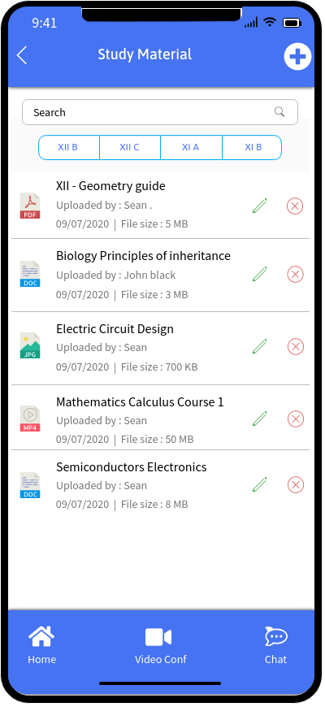

# My Digital Class Room

## Current Situation 
- COVID-19: Creating a paradigm shift in India’s Education System .The pandemic has forced universities/schools to bring their courses online.
- This is just one step along the road to a new educational paradigm, however. We can expect a new model to emerge once COVID-19 has passed
- The pandemic that has shuttered economies around the world has also battered education systems in developing and developed countries.
- Some 1.5 billion students — close to 90% of all primary, secondary and tertiary learners in the world — are no longer able to physically go to school.
- The impact has been dramatic and transformative as educators scramble to put in place workable short-term solutions for remote teaching and learning, particularly in emerging markets, where students and schools face additional challenges related to financing and available infrastructure.

##  Research and Analysis
- We conducted the survey with various schools to understand the day to day challenges that they are facing while adapting the new norm of E-learning and conducting the online classes. 
- We have identified some most common problem areas for the roles like School Authority (Principal/Vice Principal), Class Teacher, Subject Teacher and Students and have worked upon them to propose a solution in the application

##  Key Features 

-	Create and conduct classes
-	Video/Audio Conferencing
-	Manage assignments 
-	Track attendance of students attending the class
-	Manage/View study material
- Offline mode 

## User Interface Design:
 ### Principal Design FLow 
 The key for the School Authority or Principal is to have an overall view of all the activities taking place in the school. The primary functionalities available for them in the app are –
####  Key Features for Principal
-	Dashboard 
- Create/Manage Announcements for the School
-	Keep a track of any requests raised
- Video/Audio Conferencing
-	One to One/Group chat with teachers and faculties
-	Tracking attendance of teachers, faculties (non-teaching staff) and students

 #### Principal User Interface

 <table>
 <th>Principal Login</th>
  <th>Principal Dashboard</th>
 <tr>
   <td>
       
   </td>
  <td>
        
   </td>
</tr>
</table>

 <table>
 <th>View Announcement</th>
 <th>Create new Announcement</th>
  <th>Approve Pending Reequest</th>

 <tr>
   <td>
       
   
   </td>
  <td>
        
   
   </td>
     <td>
    
   </td>
</tr>
</table>

 <table>
 <th>Video Conferencing</th>
 <th>Principal Chat Room</th>
 <tr>
   <td>
  
  </td>
 <td>
  
  </td>
</tr>
</table>

 ### Class Teacher Design 
The key for the Teacher is to have an ability to conduct online classes, track the progress of each student etc. The primary functionalities available for them in the app are 

####  Key Features for Class Teacher

-	Create and conduct classes
-	Video Conferencing
-	Manage assignments 
-	Track attendance of students attending the class
-	Manage study material
-	Manage announcements for a class

 #### Class Teacher User Interface

<table>
 <th>Login</th>
 <th>Dashboard</th>
 <tr>
   <td>
    
  </td>
 <td>
    
  </td>
</tr>
</table>
<table>
  <th>Schdule CLassroom</th>
 <th>View Classroom</th>
  <th>Ongoing Classroom Summary</th>

 <tr>
 <td>
  
  </td>
   <td>
  
  </td>
  <td>
  
  </td>
 
 
</tr>
</table>

<table>
 <th>View Study Material</th>
 <th>Create new Study Material</th>
 <tr>
   <td>
  
  </td>
 <td>
  
  </td>
 
</tr>
</table>

<table>
 <th>Manage Assignment</th>
 <th>View Announcement</th>
 <th>Time Table</th>
 <tr>
   <td>
     
  </td>
 <td>
    
  </td>
 <td>
  
  </td>
</tr>
</table>

 <table>
 <th>Video Conferencing</th>
 <th>Teacher Chat Room</th>
 <tr>
   <td>
  
  </td>
 <td>
    
  </td>
</tr>
</table>

 ### Student Design Flow
The key for the Students is to have an ability to join classes. The primary functionalities available for them in the app are-
####  Key Features for Student

-	Join Classroom as per schedule
-	Submit Assignments
- Access Study Material
-	Check Class Timetable
-	Apply leaves
-	View Announcement

 #### Student User Interface

<table>
 <th>Login</th>
 <th>Dashboard</th>
 <tr>
   <td>
  
  </td>
 <td>
  
  </td>
</tr>
</table>
 

<table>
 <th>Studnet Inbox</th>
 <th>View Assignment</th>
 <th>Submit and Compelte Assignment</th>
 <tr>
   <td>
  
  </td>
 <td>
  
  </td>
   <td>
  
  </td>
</tr>
</table>

<table>
 <th>Video Conf</th>
 <th>Chatroom List</th>
 <th>Teacher & Student Priavet Chatroom</th>
 <tr>
   <td>
  
  </td>
<td>
  
  </td>
   <td>
  
  </td>
</tr>
</table>
